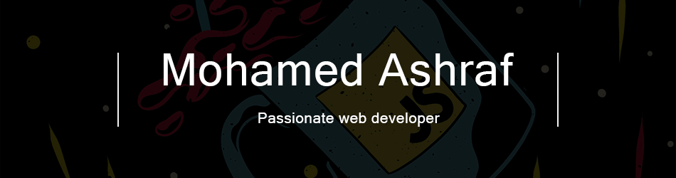

<!-- Banner-->

Mohamed is a web developer who loves code and food, skilled in creating and
maintaining stunning web applications and websites since 1995. Proficient in the latest
web technologies and frameworks, continuously expanding my skill set to stay at the forefront
of the industry.

##

 
<!---
- Web illustrations by Storyset ( https://storyset.com/web )
--->

 

- 🔍 Take a look at my projects on [**my portfolio**](https://urboifox.vercel.app)!.

- 📫 How to reach me: **mohamed.dev.egy@gmail.com**.

 
 

 
<h2 align="center">📫 Connect with me</h2>

  
&nbsp;
&nbsp;

 
<h2 align="center">📊 Github Stats</h2>

&nbsp;

 

<h2 align="center">🛠️ Languages and Tools</h2>

<!-- 
 -->

<b>🏄‍♂️ Frontend</b>

 
  
&nbsp;
&nbsp;
&nbsp;
&nbsp;
&nbsp;
&nbsp;
&nbsp;
&nbsp;
&nbsp;
&nbsp;
&nbsp;
&nbsp;
&nbsp;
&nbsp;

<b>⚙️ Backend</b>

 
  
&nbsp;
&nbsp;
&nbsp;
&nbsp;

<b>💻 Software and Tools</b>

 

&nbsp;
&nbsp;
&nbsp;
&nbsp;
&nbsp;
&nbsp;
&nbsp;
&nbsp;
&nbsp;
&nbsp;
&nbsp;

 

<h2 align="center">👨‍💻 More About Me on GitHub</h2>

<b>🔥 Streak Stats</b>

 

<b>🏆 Github Trophies</b>

 

<b>⚡ Github Public Stats</b>

 

&nbsp;

